# SecureCloudOps Copilot — End-to-End Roadmap

> **Goal:** Build a production-style, multi-tenant AI copilot that helps engineering teams investigate AWS incidents using runbooks, architecture documents, deployment history, and telemetry.
>
> **Portfolio level:** SDE-2. This is deliberately more than a “chat with PDF” project: it demonstrates system design, cloud deployment, secure RAG, MCP tools, asynchronous processing, observability, testing, and infrastructure as code.

## How to use this document

- Check an item only after it is implemented, tested, committed, and documented.
- Work through phases in order. Do not add agentic/MCP behavior until the basic RAG system is reliable.
- Keep the main branch deployable. Each completed feature should be a small pull request or a clearly scoped commit.
- Treat the **Definition of Done** at the end of each phase as the exit gate.
- The initial schedule assumes **12–15 focused hours per week**. At 6–8 hours per week, expect roughly twice the duration.

## Product definition

### Users

- **Developer / on-call engineer:** asks questions during an incident.
- **Engineering manager:** uploads and organizes team knowledge, reviews usage and audit trails.
- **Platform administrator:** manages organizations, roles, quotas, and security policies.

### Primary user story

> As an on-call engineer, I can ask why a service is failing, receive a grounded answer with citations to my team’s approved documents, and optionally use secure read-only tools to inspect recent deployment and metric summaries.

### Example scenario

A fictional e-commerce company operates `catalog`, `checkout`, and `orders` services. A team uploads their runbooks, postmortems, architecture documentation, and sample deployment events. When checkout latency rises, a developer can ask:

> “Checkout latency increased after the last deployment. What should I investigate first?”

The response must cite relevant runbooks and may call approved read-only tools for a deployment or metric summary. It must never fabricate a source or perform an unapproved AWS action.

## Success criteria

- [ ] Users can sign in and belong to one organization (tenant).
- [ ] Authorized users can upload and process Markdown, TXT, PDF, and DOCX documents.
- [ ] Users receive RAG answers with clickable, accurate citations.
- [ ] Retrieval is isolated by tenant and document access policy.
- [ ] Background ingestion is reliable, retryable, and idempotent.
- [ ] A purpose-built MCP server exposes only secure, validated tools.
- [ ] Every model/tool request has an audit record and distributed trace.
- [ ] The system is deployed on AWS through Terraform and CI/CD.
- [ ] A public GitHub repository documents architecture, tradeoffs, tests, and demo results.

## Target architecture

```mermaid
flowchart LR
    User["Authenticated user"] --> Web["Next.js web application"]
    Web --> API["FastAPI API on ECS Fargate"]
    API --> Auth["Amazon Cognito / JWT / RBAC"]
    API --> Redis["Redis / ElastiCache\ncache, rate limits, job state"]
    API --> DB["PostgreSQL / RDS\ntenants, metadata, audit records"]
    API --> Vector["pgvector locally /\nOpenSearch Serverless in AWS"]
    API --> Model["Amazon Bedrock\nLLM + embeddings"]
    API --> Guard["Guardrails + application validators"]
    API --> MCP["Custom MCP server\nallowlisted tools"]
    API --> Observability["OpenTelemetry + CloudWatch"]

    Upload["Document upload"] --> S3["Amazon S3"]
    S3 --> Queue["Amazon SQS"]
    Queue --> Worker["Ingestion worker on ECS"]
    Worker --> Vector
    Worker --> DB
```



## Final technology stack

| Area | Chosen technology | Purpose |
|---|---|---|
| Web app | Next.js, TypeScript, Tailwind CSS | Dashboard, uploads, chat, citations, admin screens |
| API | Python, FastAPI, Pydantic | Typed APIs, RAG orchestration, auth enforcement |
| Worker | Python worker process | Asynchronous parse, chunk, embed, index pipeline |
| Local environment | Docker and Docker Compose | One-command reproducible development stack |
| Relational database | PostgreSQL; Amazon RDS in cloud | Tenant/user/document/audit data |
| Vector store | pgvector locally; OpenSearch Serverless in AWS | Semantic retrieval and metadata filtering |
| Cache and coordination | Redis; Amazon ElastiCache in cloud | Cache, rate limits, token quotas, locks, job status |
| Object storage | S3 | Original source documents and ingestion artifacts |
| Async messaging | SQS | Decoupled, reliable document-processing jobs |
| LLM and embeddings | Amazon Bedrock | Model inference and embeddings |
| Agent/tool interface | Official Python MCP SDK / FastMCP | Implement custom project-specific MCP server |
| Identity | Cognito, JWT, RBAC | Authentication and organization-scoped authorization |
| Container runtime | ECR, ECS Fargate, Application Load Balancer | Image registry and container deployment |
| Security | IAM, KMS, Secrets Manager, WAF, Bedrock Guardrails | Least privilege, encryption, secrets, AI safeguards |
| Observability | OpenTelemetry, CloudWatch, X-Ray | Logs, metrics, traces, dashboards, alerts |
| Infrastructure | Terraform | Reproducible AWS environments |
| CI/CD | GitHub Actions using AWS OIDC | Test, scan, publish, deploy without static AWS keys |
| Testing | Pytest, Playwright, k6, Trivy, Gitleaks | Quality, end-to-end, performance, and security checks |

## Project boundaries

### In scope

- Secure RAG with citations and evaluation.
- Multi-tenant access control.
- Custom MCP server with read-only investigation tools.
- AWS deployment and infrastructure as code.
- AI security controls, auditability, and observability.

### Explicitly out of scope for version 1

- Autonomous production changes, such as restarting services or changing AWS resources.
- Arbitrary shell execution or arbitrary AWS CLI access by the model.
- Kubernetes/EKS. ECS Fargate is the initial deployment target.
- Fine-tuning a foundation model.
- Building a general-purpose AI assistant.

## Timeline overview

| Phase | Estimated time | Theme | Deliverable |
|---|---:|---|---|
| 0 | Week 1 | Plan and repository foundations | Architecture, backlog, GitHub setup |
| 1 | Weeks 2–3 | Local application foundation | Auth, tenants, upload UI, Docker stack |
| 2 | Weeks 4–5 | Custom RAG | Ingestion, retrieval, cited chat |
| 3 | Week 6 | Redis and reliability | Cache, quotas, job state, idempotency |
| 4 | Week 7 | RAG quality and evaluation | Evaluation suite and quality report |
| 5 | Weeks 8–9 | AWS infrastructure and deployment | Terraform-managed staging environment |
| 6 | Week 10 | MCP tools | Secure, read-only custom MCP server |
| 7 | Week 11 | AI and cloud security | Threat model, defenses, red-team tests |
| 8 | Week 12 | Observability and performance | Traces, dashboards, load tests |
| 9 | Weeks 13–14 | CI/CD and portfolio release | Automated delivery, docs, demo, resume case study |

---

# Phase 0 — Plan and GitHub foundations

**Objective:** Know what is being built before application code starts.

## Tasks

- [ ] Create a GitHub repository named `secure-cloudops-copilot`.
- [ ] Write a short repository description: “Secure multi-tenant RAG and MCP platform for AWS incident investigation.”
- [ ] Add an Apache-2.0 or MIT license. Do not publish realistic secrets or sensitive documents.
- [ ] Create a GitHub Project board with columns: `Backlog`, `Ready`, `In progress`, `In review`, `Done`.
- [ ] Turn each phase task in this document into GitHub issues.
- [ ] Add issue labels: `frontend`, `backend`, `rag`, `aws`, `security`, `mcp`, `infra`, `testing`, `documentation`.
- [ ] Define the fictional e-commerce platform: service names, owners, dependencies, SLOs, and incident types.
- [ ] Create realistic but synthetic knowledge documents: runbooks, postmortems, architecture docs, deployment notes, and metric snapshots.
- [ ] Draw a high-level architecture diagram and one sequence diagram for “upload document → answer question.”
- [ ] Write an Architecture Decision Record (ADR) explaining why ECS Fargate is selected before EKS.
- [ ] Write an ADR explaining why RAG retrieval authorization is enforced in the application and datastore rather than trusted to the LLM prompt.

## Suggested repository structure

```text
secure-cloudops-copilot/
├── apps/
│   └── web/                 # Next.js frontend
├── services/
│   ├── api/                 # FastAPI application
│   ├── worker/              # ingestion/background work
│   └── mcp-server/          # custom MCP tools
├── packages/
│   └── contracts/           # shared API/tool schemas, where appropriate
├── infra/
│   └── terraform/           # AWS environments and modules
├── docs/
│   ├── adr/
│   ├── architecture/
│   ├── security/
│   ├── evaluation/
│   └── runbooks/            # synthetic demo knowledge base only
├── tests/
│   ├── integration/
│   ├── e2e/
│   ├── load/
│   └── security/
├── docker-compose.yml
├── README.md
└── PROJECT_ROADMAP.md
```

## Definition of Done

- [ ] Repository, project board, first ADRs, synthetic domain documents, and architecture diagram exist.
- [ ] The MVP scope can be described in two minutes without mentioning implementation details.

---

# Phase 1 — Local application foundation

**Objective:** Build a secure, runnable local system before adding AI behavior.

## Backend and data model

- [ ] Create a FastAPI service with `/health` and versioned `/api/v1` routes.
- [ ] Add PostgreSQL migrations.
- [ ] Define initial entities: `Organization`, `User`, `Membership`, `Role`, `Document`, `DocumentVersion`, `Conversation`, `Message`, `AuditEvent`, and `IngestionJob`.
- [ ] Define roles: `admin`, `manager`, and `engineer`.
- [ ] Add organization ID to every tenant-owned database record.
- [ ] Implement organization-scoped authorization middleware/dependencies.
- [ ] Build an audit-event writer for authentication, document, chat, and tool activity.
- [ ] Validate all request and response payloads with Pydantic schemas.

## Frontend

- [ ] Create a Next.js TypeScript frontend.
- [ ] Add sign-in/sign-out screens. A local development auth adapter is acceptable initially.
- [ ] Add an organization-aware dashboard.
- [ ] Add a document upload page and document processing-status display.
- [ ] Add a chat page with conversation list, chat area, source/citation panel, and error states.
- [ ] Add accessible loading, empty, and failure states.

## Docker

- [ ] Create Dockerfiles for web, API, and worker services.
- [ ] Create a Docker Compose stack with web, API, worker, PostgreSQL, Redis, and a local vector-store option.
- [ ] Ensure a new contributor can run the local stack using documented commands.
- [ ] Use `.env.example`; never commit a real `.env` file or cloud credentials.
- [ ] Add health checks and service startup dependencies.

## Definition of Done

- [ ] A signed-in user can upload a document and see an ingestion record under their organization.
- [ ] The full local stack starts using Docker Compose.
- [ ] Tests confirm users in Organization A cannot read Organization B’s records.

---

# Phase 2 — Build the custom RAG system

**Objective:** Implement and understand the entire retrieval pipeline. Do not rely on an opaque “chat with documents” abstraction.

## Ingestion pipeline

- [ ] Accept Markdown, TXT, PDF, and DOCX documents.
- [ ] Store the original document and its checksum.
- [ ] Extract text and retain page/section information for citations.
- [ ] Normalize text while preserving headings and source location.
- [ ] Design an initial chunking strategy: document-aware chunks, overlap, max size, and metadata.
- [ ] Generate embeddings using a Bedrock embedding model or a local development provider.
- [ ] Store chunks, embeddings, and metadata in pgvector locally.
- [ ] Store metadata: `organization_id`, `document_id`, `version`, `source_type`, `service`, `access_level`, `chunk_index`, `page_or_section`.
- [ ] Make ingestion idempotent using document checksum and version.
- [ ] Show useful job states: `queued`, `processing`, `ready`, `failed`, `retrying`.

## Retrieval and generation

- [ ] Build a retrieval API that requires an authenticated user and organization context.
- [ ] Apply tenant and role filters before retrieval—not afterward.
- [ ] Retrieve the top-k chunks using semantic vector similarity.
- [ ] Assemble a prompt that clearly separates system instructions, user question, and untrusted retrieved content.
- [ ] Instruct the model to use only retrieved sources and explicitly say when evidence is insufficient.
- [ ] Return citations with document name, version, and page/section.
- [ ] Validate the final answer against a structured response schema.
- [ ] Persist citations and answer metadata for later evaluation/auditing.
- [ ] Add a “sources used” UI that opens the exact cited content.

## Initial quality checks

- [ ] Test a query with an answer present in the documents.
- [ ] Test a query with no supporting knowledge; the assistant must decline to invent an answer.
- [ ] Test queries from two organizations using similarly named documents; no cross-tenant citations may occur.
- [ ] Test citations point to the correct document location.

## Definition of Done

- [ ] A user receives grounded answers with verifiable citations from their own organization’s documents only.
- [ ] The project can explain chunking, embeddings, vector retrieval, prompt augmentation, and citation generation in an interview.

---

# Phase 3 — Redis, asynchronous reliability, and cost controls

**Objective:** Add the performance and coordination layer that a real AI service needs.

## Redis responsibilities

- [ ] Run Redis in Docker Compose.
- [ ] Cache safe, organization-scoped RAG answers with a short TTL and a versioned cache key.
- [ ] Cache embeddings using a hash of normalized text.
- [ ] Add a per-user and per-organization sliding-window rate limiter.
- [ ] Add daily/monthly model-token or cost quotas per organization.
- [ ] Store short-lived ingestion job progress for UI polling or server-sent events.
- [ ] Use a distributed lock to prevent duplicate processing of the same document version.
- [ ] Cache read-only MCP tool results only when freshness permits it.
- [ ] Define cache invalidation when a document is added, replaced, or permissions change.
- [ ] Add a failure strategy: Redis outage must degrade safely rather than break access control.

## Asynchronous ingestion

- [ ] Move ingestion off the request path into a background job flow.
- [ ] Add retries with bounded exponential backoff.
- [ ] Support idempotent retries with the same job ID/document version.
- [ ] Record failure reason and make a failed job retryable by an authorized user.
- [ ] Add a dead-letter strategy for repeatedly failing jobs.

## Definition of Done

- [ ] Repeated safe questions have measurable lower latency through Redis.
- [ ] Duplicate document submissions do not create duplicate chunks or embeddings.
- [ ] A document-processing failure is visible, retryable, and auditable.

---

# Phase 4 — RAG quality, evaluation, and measurable improvements

**Objective:** Demonstrate engineering judgment with data, not only a demo.

## Evaluation dataset

- [ ] Create 50–100 evaluation questions based on the synthetic document corpus.
- [ ] Categorize each question: direct fact, multi-document reasoning, missing-information, ambiguous question, and unauthorized-access test.
- [ ] Define expected supporting documents/chunks for each question.
- [ ] Keep this dataset versioned under `docs/evaluation/` or a test-data directory.

## Metrics

- [ ] Measure retrieval precision@k and recall@k.
- [ ] Measure citation correctness.
- [ ] Measure groundedness: is every material claim supported by cited context?
- [ ] Measure abstention correctness for unanswerable questions.
- [ ] Measure p50/p95 end-to-end latency.
- [ ] Measure cost per answer and cache-hit rate.

## Improvement experiments

- [ ] Compare fixed-size versus document-aware chunking.
- [ ] Add keyword/BM25 retrieval alongside vector retrieval (hybrid search).
- [ ] Add reranking and measure the impact.
- [ ] Add query rewriting only if it improves evaluation results.
- [ ] Tune top-k, chunk size, and overlap based on results rather than guessing.
- [ ] Publish a short before/after evaluation report with methodology and findings.

## Definition of Done

- [ ] The repository contains reproducible evaluation code and a written result summary.
- [ ] At least one RAG improvement is justified with measured evidence.

---

# Phase 5 — AWS infrastructure and staging deployment

**Objective:** Deploy the proven local application safely and reproducibly.

## AWS account hygiene

- [ ] Create a dedicated development AWS account or an isolated project environment.
- [ ] Enable billing alerts and a monthly budget before deploying resources.
- [ ] Use IAM Identity Center or another secure identity solution; do not use root-account access for daily work.
- [ ] Create separate `dev` and `staging` Terraform environments.
- [ ] Tag all resources with `project`, `environment`, `owner`, and `cost-center`.

## Terraform infrastructure

- [ ] Create a VPC with public and private subnets across at least two Availability Zones.
- [ ] Create security groups with minimal inbound/outbound access.
- [ ] Create ECR repositories for container images.
- [ ] Create an ECS cluster, task definitions, services, and autoscaling rules.
- [ ] Create an Application Load Balancer with HTTPS listener configuration.
- [ ] Create S3 buckets with encryption, versioning, lifecycle policy, and least-privilege bucket policy.
- [ ] Create RDS PostgreSQL with backups, encryption, and private subnet placement.
- [ ] Create ElastiCache Redis in private subnets.
- [ ] Create SQS queues and a dead-letter queue for ingestion.
- [ ] Create OpenSearch Serverless collection/index configuration, or document the chosen managed-vector alternative.
- [ ] Create Cognito user pool, app client, groups, and callback URLs.
- [ ] Create Secrets Manager secrets and ECS task-role access.
- [ ] Create CloudWatch log groups, alarms, and a basic dashboard.
- [ ] Configure KMS keys where appropriate.

## Application deployment

- [ ] Build immutable Docker images tagged with commit SHA.
- [ ] Push images to ECR.
- [ ] Deploy API and worker as independent ECS services/tasks.
- [ ] Run database migrations as a controlled deployment job.
- [ ] Configure application environment values through task definitions and Secrets Manager.
- [ ] Verify health checks, HTTPS, and rollback behavior.
- [ ] Seed only synthetic demo data in staging.

## Definition of Done

- [ ] `terraform plan` describes all infrastructure changes before application to AWS.
- [ ] A user can sign in, upload a demo document, and receive a cited answer in staging.
- [ ] No database, Redis, or internal service is publicly reachable.

---

# Phase 6 — Custom MCP server and controlled tools

**Objective:** Build your own MCP **server** using the standard MCP protocol and SDK. Do not invent a new protocol.

## MCP server foundation

- [ ] Create a separate containerized MCP server.
- [ ] Use the official Python MCP SDK / FastMCP.
- [ ] Publish tool schemas with strict types, descriptions, and input bounds.
- [ ] Require authenticated user identity and organization context to reach tools.
- [ ] Add a tool allowlist; the model must not choose arbitrary URLs, commands, or AWS APIs.
- [ ] Add request IDs, deadlines, timeout, retries where safe, and structured errors.
- [ ] Record every tool request, authorization decision, result status, and latency in the audit log.

## Version 1 tools — all read-only

- [ ] `search_runbooks(query, service)` — searches only allowed organization documents.
- [ ] `get_metric_summary(service, metric, start_time, end_time)` — returns a bounded synthetic or read-only metric summary.
- [ ] `get_deployment_context(service, start_time, end_time)` — returns recent deployment metadata.
- [ ] `get_incident_history(service)` — returns sanitized historical incident information.
- [ ] `create_incident_summary_draft(conversation_id)` — writes only an internal draft, never a production ticket without a future explicit approval flow.

## MCP safety controls

- [ ] Validate tool inputs server-side; never trust the model’s generated arguments.
- [ ] Enforce authorization in each tool implementation.
- [ ] Return the minimum data necessary for the tool’s purpose.
- [ ] Redact secrets, credentials, tokens, and unnecessary PII from tool outputs.
- [ ] Require explicit UI confirmation before any future write-capable action.
- [ ] Give all AWS integrations dedicated least-privilege IAM roles and start with read-only access.
- [ ] Write tests proving the model cannot use a tool outside its allowed organization or scope.

## Definition of Done

- [ ] The assistant can combine cited RAG context with results from at least two read-only MCP tools.
- [ ] Tool calls are attributable to a user, organization, conversation, and trace ID.
- [ ] No tool can mutate AWS resources or execute arbitrary commands.

---

# Phase 7 — AI security and cloud security

**Objective:** Treat AI security as a tested system feature, not a prompt-writing exercise.

## Threat model

- [ ] Write a threat model using OWASP LLM Top 10 and STRIDE.
- [ ] Identify assets: documents, embeddings, user data, prompts, model outputs, credentials, AWS resources, and audit logs.
- [ ] Identify trust boundaries: browser/API, API/model, API/MCP, worker/S3, service/AWS account.
- [ ] Rank threats by likelihood and impact; create mitigation issues.

## Application and AI defenses

- [ ] Separate system prompt, user prompt, and retrieved document content with clear trust labels.
- [ ] Treat every uploaded document as untrusted content.
- [ ] Detect/flag likely prompt-injection patterns in documents and user input.
- [ ] Use Bedrock Guardrails for content filtering, denied topics, and sensitive-information handling.
- [ ] Apply application-level PII/secrets redaction before storing logs or passing data to models where required.
- [ ] Enforce tenant/RBAC filtering in the database and vector queries.
- [ ] Require citations for material factual claims; return uncertainty rather than invented content.
- [ ] Validate structured model output and reject invalid/unsafe responses.
- [ ] Configure model and request quotas, rate limits, and abuse alerts.
- [ ] Never put credentials or secrets in prompts, chat histories, source documents, or logs.

## Cloud security

- [ ] Use least-privilege IAM task roles; do not use broad administrator policies.
- [ ] Encrypt S3, RDS, and OpenSearch data at rest.
- [ ] Store secrets in Secrets Manager, not source code or task definitions.
- [ ] Keep stateful services in private subnets.
- [ ] Use HTTPS, secure headers, CORS restrictions, and WAF rules.
- [ ] Enable CloudTrail and retain appropriate audit logs.
- [ ] Run dependency, secret, and container-image scans in CI.

## Red-team test cases

- [ ] User asks for another organization’s private documents.
- [ ] A retrieved document contains “ignore your instructions” prompt injection text.
- [ ] User attempts to make the model expose system prompts or credentials.
- [ ] User instructs the agent to call an unapproved AWS action.
- [ ] Tool response contains a secret-like string.
- [ ] User overwhelms the API/model quota.
- [ ] Model cites a document that was not retrieved.

## Definition of Done

- [ ] Threat model, mitigations, and red-team results are committed under `docs/security/`.
- [ ] Security tests run automatically and demonstrate tenant isolation, tool restrictions, and prompt-injection handling.

---

# Phase 8 — Observability, resilience, and performance

**Objective:** Be able to explain what the system is doing when it succeeds, slows down, or fails.

## Observability

- [ ] Add a correlation ID from browser request through API, worker, model call, and MCP tool call.
- [ ] Instrument API routes, PostgreSQL queries, Redis operations, SQS jobs, Bedrock calls, and MCP calls with OpenTelemetry.
- [ ] Log structured JSON with no secrets or raw sensitive content.
- [ ] Create CloudWatch dashboard widgets for request count, error rate, p50/p95 latency, queue depth, job failures, cache-hit rate, model cost, and tool failures.
- [ ] Add alerts for API errors, queue age, dead-letter messages, quota spikes, failed ingestion, and unusual denied requests.

## Resilience and performance

- [ ] Add timeouts, safe retries, circuit breaking or graceful fallback for external dependencies.
- [ ] Confirm cache outage, vector-store outage, model outage, and queue outage behaviors.
- [ ] Add health/readiness checks that distinguish “process is alive” from “service can handle traffic.”
- [ ] Run load tests for upload and chat paths using k6.
- [ ] Establish baseline latency and throughput goals.
- [ ] Run a small failure-injection exercise and document outcomes.

## Definition of Done

- [ ] A single trace tells the story of a chat request from HTTP request to citations and tool calls.
- [ ] You can identify the bottleneck during a deliberately induced slow request.

---

# Phase 9 — CI/CD, documentation, and portfolio release

**Objective:** Make the project easy to review, run, and discuss in an interview.

## GitHub workflow

- [ ] Protect the `main` branch; require pull-request checks before merge.
- [ ] Use short-lived branches such as `feat/rag-ingestion` or `fix/tenant-filter`.
- [ ] Use conventional, descriptive commit messages, for example `feat(rag): add tenant-filtered retrieval`.
- [ ] Open pull requests with summary, test evidence, security considerations, screenshots, and rollback notes.
- [ ] Link each pull request to its GitHub issue.
- [ ] Never commit `.env`, cloud keys, state files containing secrets, private data, or real production documents.

## CI pipeline

- [ ] Run frontend linting/type checks and backend formatting/linting/type checks.
- [ ] Run unit and integration tests.
- [ ] Run RAG evaluation subset for pull requests; full suite on main/nightly.
- [ ] Scan dependencies, Git history for secrets, and Docker images.
- [ ] Build Docker images and tag with commit SHA.
- [ ] Publish images to ECR only from approved branches/workflows.

## CD pipeline

- [ ] Authenticate GitHub Actions to AWS with OIDC—no static AWS access keys.
- [ ] Run `terraform fmt`, validation, and plan.
- [ ] Require review for production infrastructure applies.
- [ ] Deploy to staging automatically after merge to main.
- [ ] Run smoke tests after deployment.
- [ ] Support an application rollback to the previous immutable image.

## Documentation and presentation

- [ ] Write a strong README with product story, architecture diagram, stack, setup, screenshots, and demo flow.
- [ ] Document local setup and AWS deployment prerequisites.
- [ ] Publish ADRs for key decisions and rejected alternatives.
- [ ] Publish RAG evaluation report and security threat model.
- [ ] Record a 3–5 minute demo video: login, upload, grounded answer, citations, MCP investigation, audit trail, and dashboard.
- [ ] Create a one-page system-design explanation for interviews.
- [ ] Add 2–3 quantified resume bullets based on real measured results.

## Definition of Done

- [ ] A reviewer can clone the repository, understand the design, and run the local version from the README.
- [ ] CI is green, staging is deployed, and the demo video shows the principal user journey.
- [ ] You can explain one technical tradeoff, one failure scenario, one security decision, and one quality metric for each major component.

---

# Testing checklist

## Unit tests

- [ ] Chunking and metadata generation.
- [ ] Query/tenant/RBAC filters.
- [ ] Citation mapping.
- [ ] Redis cache-key construction and invalidation.
- [ ] Rate-limit and quota calculations.
- [ ] MCP input validation and authorization.
- [ ] PII/secret-redaction logic.

## Integration tests

- [ ] Upload → S3/local store → queue → worker → vector index lifecycle.
- [ ] Retrieval with expected citations.
- [ ] RDS, Redis, vector store, and Bedrock adapters.
- [ ] SQS retry and duplicate-message handling.
- [ ] Cognito/JWT verification in staging or an equivalent test adapter locally.

## End-to-end tests

- [ ] Sign in, upload a document, wait for ready state, ask question, verify source display.
- [ ] Organization isolation.
- [ ] Rate-limit message and quota message.
- [ ] MCP tool invocation display and audit event.

## Non-functional tests

- [ ] Load test documented traffic profile.
- [ ] Container vulnerability scan.
- [ ] Secret scan.
- [ ] Prompt-injection/red-team suite.
- [ ] Disaster/failure behavior test for unavailable dependency.

---

# Cost-control checklist

- [ ] Create AWS Budget and billing alerts before provisioning anything.
- [ ] Use local Docker services for daily development.
- [ ] Use staging only when validating cloud deployment.
- [ ] Set model quotas and cache repeated requests.
- [ ] Use small synthetic documents and a limited evaluation dataset.
- [ ] Tag all AWS resources.
- [ ] Review resources weekly and delete non-essential staging resources when not actively testing.
- [ ] Use `terraform destroy` only for the explicitly selected non-production environment and only after reviewing the plan.

---

# Stretch goals — only after version 1 is complete

- [ ] Add document-level permissions beyond organization-level isolation.
- [ ] Add hybrid search with learned reranking.
- [ ] Add multimodal document ingestion for architecture diagrams.
- [ ] Add human approval workflow for creating an incident ticket draft in Jira/Linear.
- [ ] Add a read-only CloudWatch integration protected by a dedicated IAM role.
- [ ] Deploy the MCP server on Amazon Bedrock AgentCore and compare it with ECS deployment.
- [ ] Add semantic caching with careful authorization-aware cache keys.
- [ ] Add canary releases and blue/green deployment.
- [ ] Add multi-region disaster-recovery design documentation.
- [ ] Compare self-managed RAG with Amazon Bedrock Knowledge Bases and document the tradeoffs.

---

# Interview-ready outcomes

By completing this project, you should be able to demonstrate:

- **Backend design:** multi-tenant REST APIs, async job processing, idempotency, retries, caching, and data modeling.
- **AI engineering:** custom RAG, embeddings, hybrid retrieval, reranking, citations, evaluation, and cost/latency tradeoffs.
- **MCP/agents:** secure tool design, schema validation, authentication, authorization, allowlisting, and auditability.
- **AWS/cloud:** ECS, ECR, S3, RDS, OpenSearch, ElastiCache, SQS, Cognito, IAM, KMS, CloudWatch, and Terraform.
- **Security:** tenant isolation, least privilege, secrets management, prompt-injection defenses, PII protection, and red-team testing.
- **SDE-2 ownership:** architecture decisions, CI/CD, observability, operational readiness, documentation, and measured improvements.

## Resume bullet template

> Built **SecureCloudOps Copilot**, a multi-tenant AWS incident-investigation platform using FastAPI, Next.js, Docker, ECS Fargate, Bedrock, OpenSearch, Redis, and Terraform; implemented cited RAG, secure MCP-based tooling, tenant-isolated retrieval, AI security controls, and end-to-end observability.

Replace the final version with real metrics, for example latency reduction from Redis caching, retrieval-quality improvement from reranking, or test coverage.
