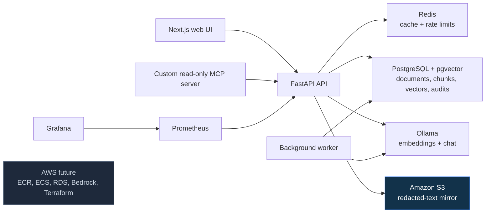

# SecureCloudOps Copilot

SecureCloudOps Copilot is a security-focused AI assistant for investigating cloud and production incidents from approved engineering knowledge.

It lets an engineering team upload synthetic runbooks, deployment records, Markdown, TXT, digital PDF, and DOCX documents; process them into vector embeddings; and ask grounded questions that return source citations instead of unsupported answers.

> This repository uses only synthetic NimbusCart demonstration data. Never upload real production documents, credentials, customer data, or AWS keys.

## What works today

- Next.js and TypeScript investigation UI
- FastAPI API with OpenAPI documentation
- PostgreSQL + pgvector knowledge store
- Redis response cache and request rate limiting
- Local Ollama embeddings (`mxbai-embed-large`) and generation (`qwen3:4b-instruct`)
- Cited RAG answers with relevance thresholds and safe abstention
- Citation validation and deterministic output-safety validation
- Secret redaction before document storage, chunking, embedding, and retrieval
- Markdown, TXT, digital PDF, and DOCX document uploads
- Private, versioned, AES-256-encrypted Amazon S3 mirroring for redacted extracted document text
- Background Docker worker for automatic chunking and embedding
- PostgreSQL audit events correlated through server-generated request IDs
- Custom read-only MCP server with approved knowledge, deployment, and runbook access
- Prometheus API/RAG metrics and a local Grafana dashboard
- GitHub Actions checks for API tests, web lint/build, and committed-secret scanning

## Local architecture



## Document ingestion flow

```text
Browser upload
  -> file-type and size validation
  -> Markdown/TXT/PDF/DOCX text extraction
  -> deterministic secret redaction
  -> PostgreSQL document record and safe audit event
  -> optional private S3 mirror of redacted extracted text
  -> background worker chunks the document
  -> Ollama generates embeddings
  -> pgvector stores the retrieval vectors
```

Only extracted, redacted text reaches S3. Original uploaded PDF and DOCX binaries are not mirrored in this V0.1 implementation.

## Main API routes

| Route | Purpose |
|---|---|
| `GET /health` | Lightweight API health check |
| `GET /ready` | PostgreSQL and Redis readiness check |
| `GET /metrics` | Prometheus metrics endpoint |
| `POST /api/v1/documents` | Validates, redacts, and accepts a synthetic document upload |
| `GET /api/v1/documents` | Lists document ingestion status |
| `POST /api/v1/ask` | Returns a grounded answer or safe insufficient-evidence result |
| `GET /api/v1/deployments/{service}/{version}` | Returns approved deployment context |
| `GET /api/v1/runbooks/{runbook_name}` | Returns approved runbook context |

The interactive API documentation is available at `http://127.0.0.1:8000/docs` when the Compose API service is running.

## Local setup

### Prerequisites

- Docker Desktop with Docker Compose
- Node.js and npm
- Python 3.14 and `uv`
- AWS CLI only when verifying the optional S3 backend

### Start the local platform

1. Copy `.env.example` to `.env` and set a local-only PostgreSQL password and Grafana password.
2. Start the container services:

   ```powershell
   docker compose up -d --build
   ```

3. Pull the local embedding and chat models once:

   ```powershell
   docker compose exec ollama ollama pull mxbai-embed-large
   docker compose exec ollama ollama pull qwen3:4b-instruct
   ```

4. Apply database migrations and load the synthetic sample documents:

   ```powershell
   cd services/api
   uv run alembic upgrade head
   uv run python -m scripts.ingest_demo_data --source-dir ../../docs/demo-data
   ```

5. Start the frontend in a second terminal:

   ```powershell
   cd apps/web
   npm install
   npm run dev
   ```

The local web application runs at `http://localhost:3000`. Grafana runs at `http://127.0.0.1:3001`, and Prometheus runs at `http://127.0.0.1:9090`.

### Quality checks

```powershell
cd services/api
uv run ruff check .
uv run python -m pytest -q

cd ../../apps/web
npm run lint
npm run build
```

## S3 document-storage checkpoint

The project has a verified Amazon S3 integration for redacted document text:

- S3 receives only extracted, redacted UTF-8 text—not original PDF/DOCX binaries.
- Objects are tenant-scoped and the database stores only safe references: bucket, key, version ID, and ETag.
- The bucket uses Block Public Access, versioning, default AES-256 encryption, and synthetic-data classification tags.
- The API fails closed if configured S3 storage is unavailable: no incomplete document is accepted.
- Local Docker Compose intentionally does not receive host AWS credentials. The S3 proof uses a host-mode API process and the `securecloudops-dev` AWS CLI profile.
- A future ECS deployment will replace the local profile with a least-privilege task IAM role.

To enable the host-mode S3 backend for a verified development demo, set these values only in the ignored root `.env` file:

```dotenv
DOCUMENT_STORAGE_BACKEND=s3
DOCUMENT_STORAGE_S3_BUCKET=your-private-bucket-name
AWS_PROFILE=your-aws-cli-profile
AWS_REGION=us-east-1
```

Do not mount personal AWS credentials into Docker containers.

## Security boundaries

- Tenant-scoped document retrieval is enforced by the API.
- Retrieval rejects low-relevance evidence instead of asking the model to guess.
- Answers require verifiable source citations; invalid citations are hidden.
- Deterministic output checks reject selected unsafe operational recommendations.
- Secret redaction occurs before document storage, chunking, embedding, retrieval, and optional S3 storage.
- Redis caches safe RAG responses but does not cache insufficient-evidence answers.
- API request IDs connect safe audit events without storing raw questions or generated answers.
- MCP capabilities are read-only and bounded; arbitrary shell, SQL, and AWS actions are prohibited.
- Local services bind to loopback addresses rather than being exposed publicly.

## AWS roadmap

Amazon S3 is now a real, verified V0.1 integration. The remaining AWS work is intentionally staged:

1. Resolve Amazon Bedrock model authorization and validate the existing adapter with a low-cost embedding model.
2. Create cost budgets and alerts before using paid services beyond the current learning allowance.
3. Package the API and worker images in Amazon ECR.
4. Deploy the containers to ECS using least-privilege task IAM roles.
5. Move PostgreSQL to RDS and Redis to ElastiCache only when the application is ready for a cloud staging environment.
6. Define reproducible AWS infrastructure with Terraform.

## Project status

The project is actively progressing through the versioned roadmap in [VERSIONED_ROADMAP.md](VERSIONED_ROADMAP.md).

- Current focus: final V0.1 release verification.
- Local RAG, document ingestion, caching, rate limiting, MCP, security checks, auditing, metrics, dashboards, CI, Terraform-managed S3 storage, and screenshot evidence are implemented.
- Amazon Bedrock was explored; local Ollama is the verified and documented V0.1 provider while Bedrock authorization remains unresolved.
- Remaining V0.1 gates: pull-request merge to `main`, annotated `v0.1.0` tag, and GitHub Release publication.
- Cloud deployment, authentication/RBAC, production observability, and advanced retrieval remain later roadmap work.

## Technology stack

Next.js, TypeScript, FastAPI, Python, Pydantic, SQLAlchemy, Alembic, Docker, Docker Compose, PostgreSQL, pgvector, Redis, Ollama, Amazon S3, Amazon Bedrock, AWS CLI, `boto3`, MCP, Prometheus, Grafana, PyMuPDF, `python-docx`, Pytest, GitHub Actions, and Gitleaks.

## Documentation

- [Versioned roadmap](VERSIONED_ROADMAP.md)
- [Project roadmap](PROJECT_ROADMAP.md)
- [Architecture decision: ECS before Kubernetes](docs/adr/0001-ecs-before-kubernetes.md)
- [Architecture decision: redacted text S3 storage](docs/adr/0002-redacted-text-s3-storage.md)
- [Threat model](docs/security/threat-model-v1.md)
