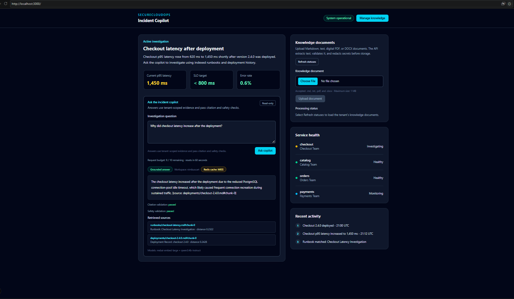
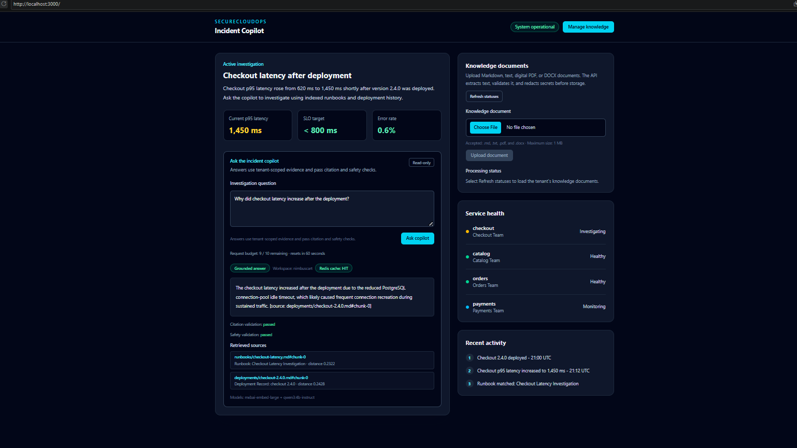
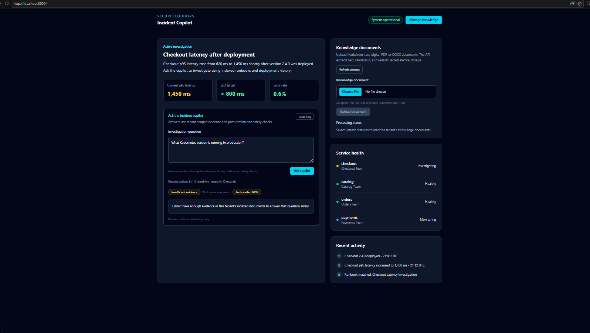
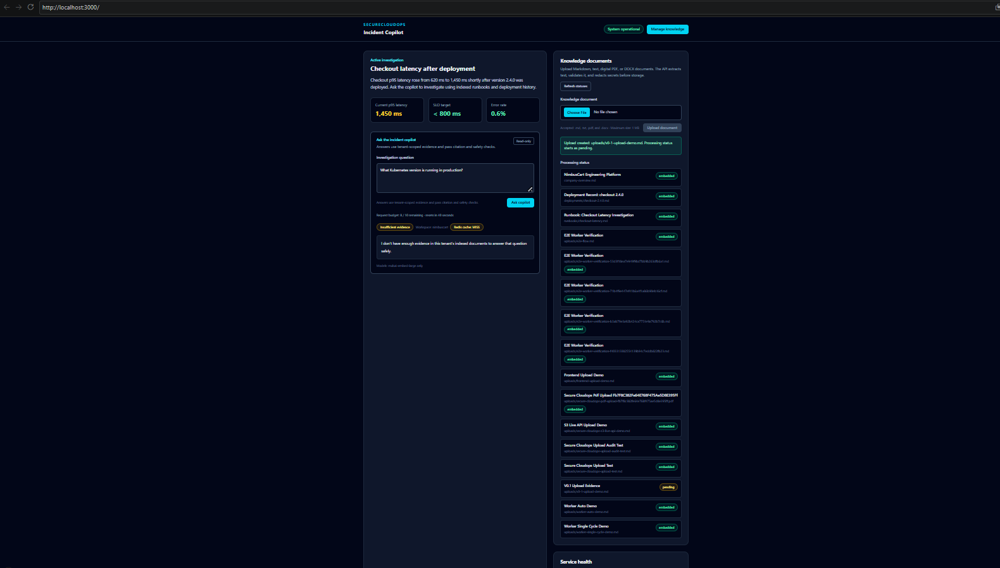
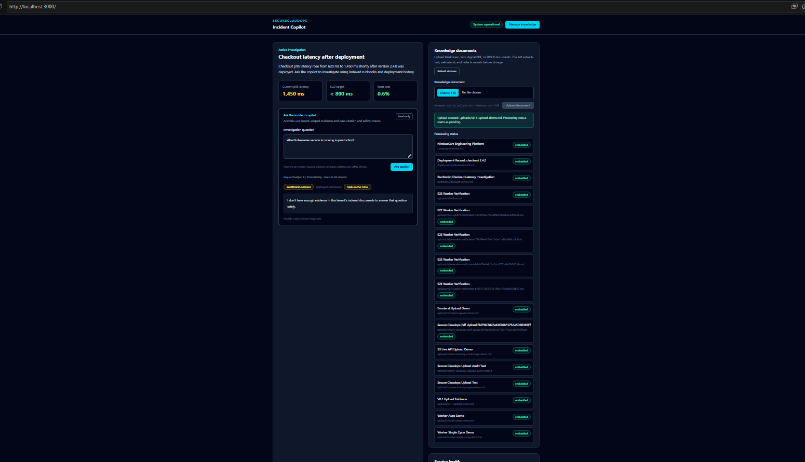
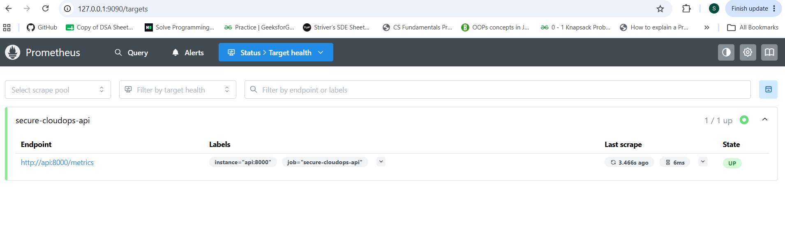
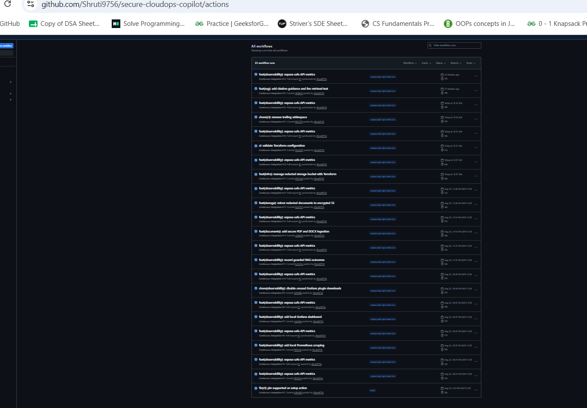
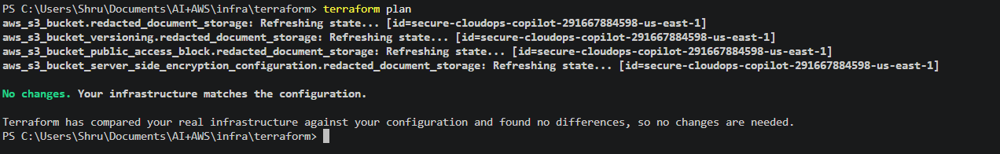
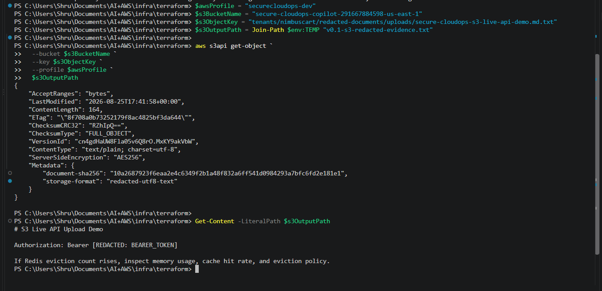

# SecureCloudOps Copilot — V0.1 Release Checklist

> Release goal: A local-first, resume-ready Secure CloudOps copilot that safely answers incident-investigation questions from tenant-scoped knowledge and demonstrates AWS, Docker, Redis, RAG, MCP, AI security, observability, and infrastructure-as-code practices.

## What V0.1 means

V0.1 is a working, documented, demoable release candidate. Local Docker services and Ollama power the demo, while AWS S3 provides an optional verified cloud-storage integration for redacted document content.

It is not a production deployment and does not yet include authentication, RBAC, ECS, or managed AWS databases.

## Completed product capabilities

- [x] Next.js web interface for tenant-scoped incident questions.
- [x] FastAPI API with health, readiness, OpenAPI, document, deployment, runbook, and RAG answer endpoints.
- [x] PostgreSQL with pgvector for tenants, documents, chunks, embeddings, and audit events.
- [x] Alembic migrations for reproducible schema evolution.
- [x] Markdown, text, PDF, and DOCX uploads.
- [x] Deterministic secret redaction before storage, chunking, embedding, retrieval, and S3 storage.
- [x] Background Docker worker for automatic chunking and embedding.
- [x] Local Ollama embeddings using `mxbai-embed-large`.
- [x] Local Ollama answer generation using `qwen3:4b-instruct`.
- [x] Tenant-scoped vector retrieval with a relevance threshold.
- [x] Grounded RAG answers with source citations.
- [x] Citation validation that hides invalidly cited answers.
- [x] Safety validation that blocks selected unsafe operational recommendations.
- [x] Safe insufficient-evidence refusal.
- [x] Redis response caching and fixed-window rate limiting.
- [x] Request IDs and safe PostgreSQL audit events.
- [x] Prometheus metrics with low-cardinality labels.
- [x] Prometheus scraping and Grafana dashboard support.
- [x] Read-only MCP tools, resources, and prompts.
- [x] Docker Compose local development environment.

## Completed AWS and infrastructure evidence

- [x] AWS CLI profile configured for a dedicated development IAM user.
- [x] Bedrock model discovery attempted and documented.
- [x] Local Ollama selected as the verified fallback while Bedrock invocation authorization remains unresolved.
- [x] Private S3 bucket for redacted extracted document text only.
- [x] S3 Block Public Access, versioning, and default SSE-S3 encryption.
- [x] S3 verification proves redacted text rather than original secret-bearing content is stored.
- [x] Terraform imports and manages the existing S3 bucket security controls.
- [x] Terraform plan verified with no infrastructure drift.
- [x] GitHub Actions runs Terraform format and validation without AWS credentials.

## Completed quality and security evidence

- [x] Ruff formatting and linting configured for Python code.
- [x] Next.js lint and production build passing.
- [x] GitHub Actions checks API tests, web quality, secret scanning, and Terraform validation.
- [x] Gitleaks reports no detected committed secrets.
- [x] Threat model documents STRIDE and OWASP LLM-oriented risks.
- [x] AI-security evaluation catalogue exists.
- [x] Automated API suite: 153 passing tests, with live E2E tests intentionally deselected.
- [x] Live E2E test: upload → worker processing → Ollama embedding → tenant-scoped pgvector retrieval.
- [x] Deterministic tests cover citation validation, safety validation, cache behaviour, rate limiting, and insufficient-evidence handling.
- [x] Manual API and UI demos confirm grounded answers with valid citations.

## Captured V0.1 screenshot evidence

All screenshots use synthetic demonstration data only.

- [x] Grounded answer with Redis cache miss.

- [x] Grounded answer with citation validation, safety validation, and Redis cache hit.

- [x] Insufficient-evidence refusal.

- [x] Uploaded document accepted in pending state.

- [x] Worker-processed document in embedded state.

- [x] Prometheus target shows the API as healthy.

- [x] GitHub Actions workflow succeeds.

- [x] Terraform reports no infrastructure drift.

- [x] S3 verification proves that stored document text is redacted.

## Remaining V0.1 release gates

- [ ] Re-run the complete verification suite from a fresh local clone using the README.
- [ ] Open and merge the pull request from `codex/add-api-metrics` to `main`.
- [ ] Create annotated Git tag `v0.1.0`.
- [ ] Publish GitHub Release `v0.1.0`.

A short recording is optional portfolio material; the screenshot evidence above is the required visual proof for V0.1.

## Explicitly out of scope for V0.1

- Authentication and user accounts.
- Cognito and role-based access control.
- Production AWS deployment with ECR, ECS, ALB, RDS, ElastiCache, and Secrets Manager.
- Terraform remote state and team infrastructure workflow.
- Production Bedrock model invocation and Bedrock Guardrails.
- Load testing, distributed tracing, and advanced RAG evaluation automation.
- Multi-tenant identity isolation beyond the current tenant-scoped data model.

## V0.1 completion definition

V0.1 is complete when every item under **Remaining V0.1 release gates** is checked, the pull request is merged to `main`, and the immutable `v0.1.0` Git tag and GitHub Release exist.