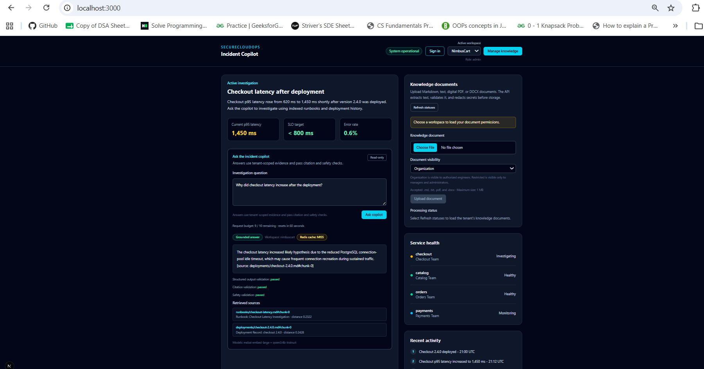
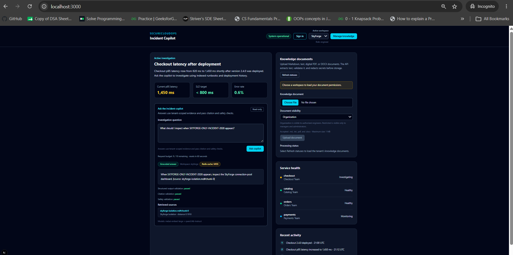
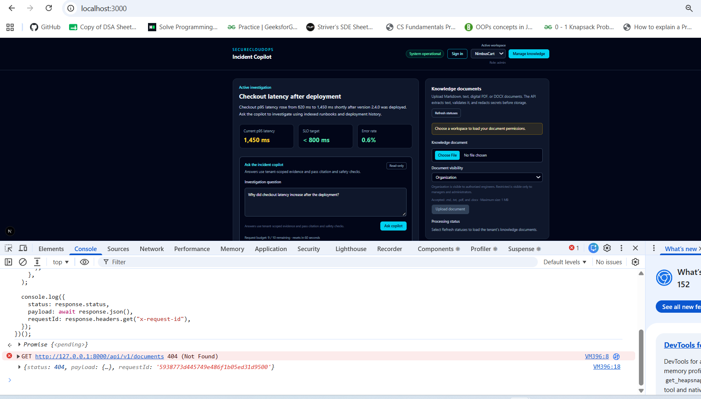
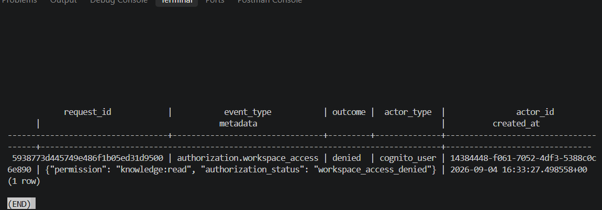
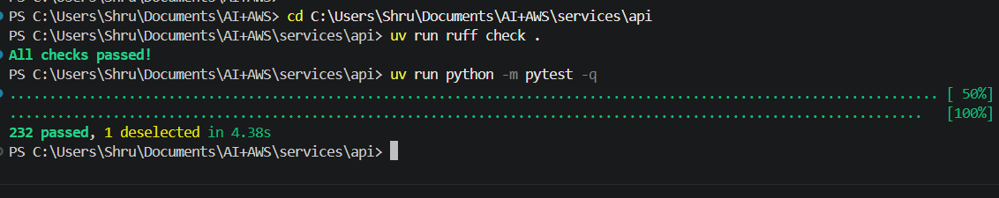
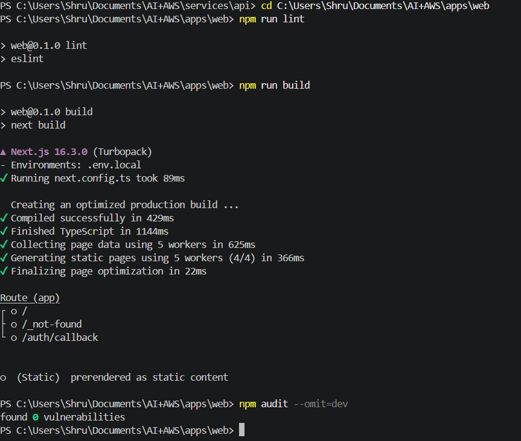
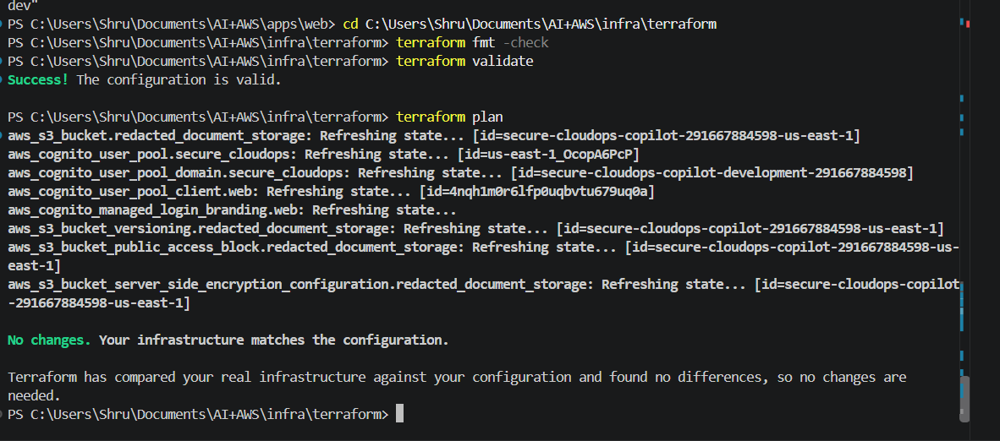

# SecureCloudOps Copilot — V0.2 Release Checklist

> Release goal: a locally verified multi-tenant secure-RAG baseline that proves server-side Cognito authorization, organization isolation, role-aware document access, structured model-output validation, and authorized redacted-document downloads.

## What V0.2 means

V0.2 builds on the released V0.1 local RAG MVP. It adds real authenticated identity and authorization decisions to the local development flow. The browser chooses a workspace for usability, but the API verifies the Cognito access token, PostgreSQL membership, organization, and role before it retrieves, writes, or prepares a document download.

This is not a production deployment. The project uses synthetic demonstration data only and does not claim database row-level security, production workload IAM roles, private networking, centralized audit retention, or complete AI-security coverage.

## Completed product capabilities

- [x] Organizations, users, memberships, tenant workspaces, and `admin`, `manager`, and `engineer` roles in PostgreSQL.
- [x] Cognito Hosted UI authorization-code sign-in with PKCE in the Next.js application.
- [x] Server-side JWT verification for issuer, app client, token use, expiry, signature, and JWKS keys.
- [x] API-side organization membership and role authorization; browser controls do not grant permission.
- [x] Privacy-preserving `404` response and correlated denial audit for cross-workspace access.
- [x] Organization-scoped documents, chunks, retrieval, cache keys, and audit records.
- [x] Organization and restricted document visibility: engineers read organization documents; managers and administrators also read restricted documents and can upload or update documents.
- [x] Narrow secret and PII redaction before persistence, embeddings, retrieval, logs, and optional S3 mirroring.
- [x] Prompt-injection handling for untrusted user questions and retrieved evidence.
- [x] Strict Pydantic validation of model-produced answer/citation JSON before a response is shown.
- [x] Safe withholding of malformed structured output, invalid citations, unsafe output, and insufficient-evidence answers.
- [x] Authorized, short-lived, version-pinned S3 links for already-redacted text only.
- [x] Background document worker processing across all workspaces.

## Completed infrastructure and quality checks

- [x] Terraform-managed Cognito user pool, web client, managed-login domain, branding, and existing private S3 controls.
- [x] Terraform format, validation, and no-drift plan verified against the development account.
- [x] API quality suite: 232 passed, 1 opt-in end-to-end test deselected.
- [x] Web lint and production build passed.
- [x] Docker Compose rebuild and readiness check passed after the GHCR image pull succeeded.
- [x] Committed-secret scanning and existing CI checks remain configured.

## Captured V0.2 evidence

All screenshots contain synthetic demonstration data only. They do not include passwords, JWTs, AWS credentials, or presigned S3 URLs.

- [x] NimbusCart administrator receives a grounded answer whose structured-output, citation, and safety validations pass.

- [x] SkyForge engineer sees only SkyForge evidence and role-aware read-only document controls.

- [x] A NimbusCart administrator’s cross-workspace API request is denied with a privacy-preserving `404`.

- [x] The denied request is correlated to a safe `authorization.workspace_access` audit event.

- [x] The API suite passes with 232 tests.

- [x] Frontend lint and production build pass.

- [x] Terraform reports no infrastructure drift.

## Final V0.2 release gates

- [x] Clean-clone static verification passed from `codex/v02-identity-foundation`: a new ignored `.env` was created from the committed `.env.example`; API quality checks passed with 232 tests and 1 opt-in test deselected; web audit, lint, and production build passed; the final clone worktree was clean. No personal `.env` values, AWS credentials, access tokens, or browser session data were copied.
- [x] Merged V0.2 release pull request #2 into `main` after all eight required CI checks passed.
- [x] Created annotated Git tag `v0.2.0`.
- [x] Published [GitHub Release `v0.2.0`](https://github.com/Shruti9756/secure-cloudops-copilot/releases/tag/v0.2.0) with the release notes from `CHANGELOG.md`.

V0.2 is complete when every item in **Final V0.2 release gates** is checked, the pull request is merged, and the immutable tag and GitHub Release exist.
